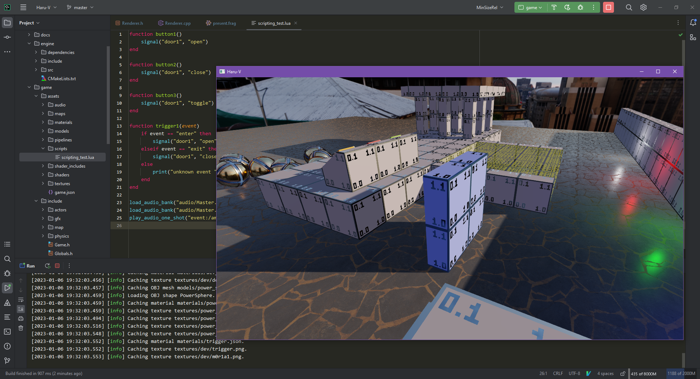

# Haru-V Engine

A Vulkan-based rewrite of [Haru Engine](https://github.com/andyroiiid/haru).

## Status

- Rendering
    - [x] Basic Vulkan rendering
    - [x] Deferred Rendering Pipeline
    - [x] Physically Based Lighting
    - [x] Cascade Shadow Map
    - [ ] FXAA Integration
- Level Editing
    - [x] Modified TrenchBroom: https://github.com/andyroiiid/TrenchBroom-Haru
    - [x] Custom level format (see docs/haru.hexpat)
- Game Entities
    - [x] First-person controller
    - [x] Static/kinematic/physically-simulated BSP brushes
    - [x] Quake/Hammer style entities
- Scripting
    - [x] Entity Events
    - [x] Lua Level Script
- UI
    - [ ] Immediate-mode UI System
- Sound
    - [x] [FMOD](https://fmod.com/) Integration
- Physics
    - [x] PhysX 5 Integration

## Dependencies

- [Vulkan SDK](https://www.lunarg.com/vulkan-sdk/)
    - Obviously...
- [fmt](https://github.com/fmtlib/fmt)
    - Currently just a dependency of spdlog
- [spdlog](https://github.com/gabime/spdlog)
    - Logging library
- [physfs](https://github.com/icculus/physfs)
    - File system abstraction
- [simdjson](https://github.com/simdjson/simdjson)
    - JSON parsing
- [glfw](https://github.com/glfw/glfw)
    - Window handling
- [glslang](https://github.com/KhronosGroup/glslang)
    - Runtime shader compilation & SPIR-V generation.
- [VulkanMemoryAllocator](https://github.com/GPUOpen-LibrariesAndSDKs/VulkanMemoryAllocator)
    - De facto library for Vulkan memory management?
- [glm](https://github.com/g-truc/glm)
    - Mathematics
- [stb](https://github.com/nothings/stb)
    - stb_image.h for image loading
- [tinyobjloader](https://github.com/tinyobjloader/tinyobjloader)
    - OBJ model loading
