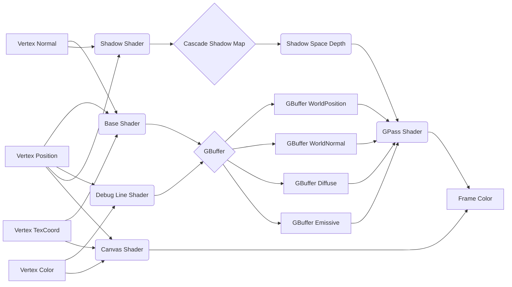
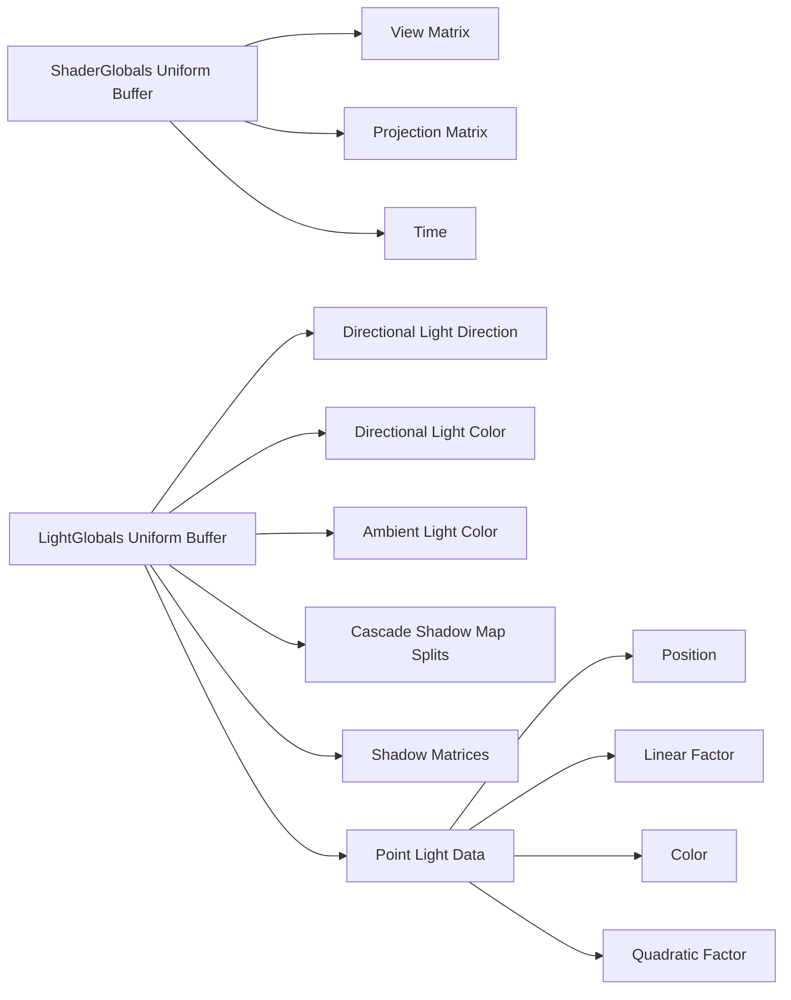

# Graphics Pipeline Graph

Just a very rough graph for my own reference.

## Pipeline

```mermaid
flowchart LR

VP[Vertex Position] --> VS(Base Shader)
VN[Vertex Normal] --> VS
VT[Vertex TexCoord] --> VS

VP --> LS(Debug Line Shader)
VC[Vertex Color] --> LS

VP --> SS(Shadow Shader)
VN --> SS

VP --> CS(Canvas Shader)
VT --> CS
VC --> CS

VS --> GB{GBuffer}
LS --> GB
SS --> SM{Cascade Shadow Map}

GB --> GP[GBuffer WorldPosition]
GB --> GN[GBuffer WorldNormal]
GB --> GD[GBuffer Diffuse]
GB --> GE[GBuffer Emissive]
SM --> SD(Shadow Space Depth)

GP --> GS(GPass Shader)
GN --> GS
GD --> GS
GE --> GS
SD --> GS

GS --> FC[Frame Color]
CS --> FC
```

## Uniform Buffers

```mermaid
flowchart LR

UBS[ShaderGlobals Uniform Buffer] --> MV[View Matrix]
UBS --> MP[Projection Matrix]
UBS --> T[Time]

UBL[LightGlobals Uniform Buffer] --> DLD[Directional Light Direction]
UBL --> DLC[Directional Light Color]
UBL --> ALC[Ambient Light Color]
UBL --> CSM[Cascade Shadow Map Splits]
UBL --> SMS[Shadow Matrices]
UBL --> PLD[Point Light Data]

PLD --> PLP[Position]
PLD --> PLL[Linear Factor]
PLD --> PLC[Color]
PLD --> PLQ[Quadratic Factor]
```
